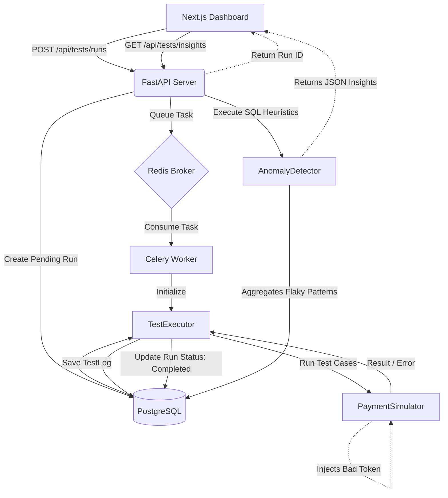

<div align="center">
  
  
  # PayTest AI - Payment Test Automation Platform
  
  **A production-grade, AI-powered automation framework designed to simulate, execute, and validate digital payment systems.**
</div>

---

## 📖 Overview

PayTest AI is a full-stack Quality Engineering (QE) platform customized for the complexities of modern payment gateways (similar to Stripe or Apple Pay). It doesn't just run tests; **it simulates the chaotic nature of the real world**. By algorithmically injecting dynamic network latencies, token expirations, partial captures, and intermittent downstream failures, PayTest AI validates whether your payment architecture is truly resilient.

Beyond simulation, the platform features an **AI Anomaly Detection engine** that continually analyzes execution logs to automatically flag flaky tests, consistent structural failures, and unusual latency spikes.

---

## 🎨 Platform Gallery

Please place the corresponding screenshots in the \`docs/images/\` directory.

### 1. Platform Overview (Dashboard)
The main dashboard visualizes real-time global latency trends, average suite execution speeds, and the active status of the async worker queue.
*[Screenshot Placeholder: You can drag and drop your Platform Overview image here in the GitHub editor]*

### 2. Execute Test Suites
A dedicated interface to safely trigger parallel execution blocks without blocking the main UI thread.
*[Screenshot Placeholder: You can drag and drop your Execute Test Suites image here in the GitHub editor]*

### 3. Recent Executions
Live, streaming logs of batch run summaries calculating total simulated latency.
*[Screenshot Placeholder: You can drag and drop your Recent Executions image here in the GitHub editor]*

### 4. AI Anomaly Insights
The automated heuristics engine categorizing flaky behavior across millions of mocked transactions.
*[Screenshot Placeholder: You can drag and drop your AI Anomaly Insights image here in the GitHub editor]*

---

## 🧠 Architecture & Tech Stack

This platform is divided into a robust, decoupled architecture simulating a production-grade enterprise system.

*   **Frontend**: Next.js (App Router), React, TailwindCSS, Recharts, Axios
*   **Backend framework**: FastAPI (Python)
*   **Async Task Queue**: Celery + Redis
*   **Database**: PostgreSQL + SQLAlchemy (ORM)
*   **Infrastructure**: Docker Compose

---

## ⚙️ Backend Deep-Dive: What's Happening Behind The Scenes?

The true power of PayTest AI lies strictly behind its polished UI. Here is the operational flowchart of a single Test Suite Execution:



### 1. The Payment Simulator (`domain/simulation.py`)
This engine intercepts normal payment flow to simulate disastrous scenarios programmatically:
*   **High Latency / Timeouts**: Capable of distributing latency via Pareto curves (typically 50-200ms) but randomly spiking up to 1.2s or causing a complete thread blockage (1.5s sleep + explicit Drop).
*   **Duplicate Transactions**: Enforces idempotent processing natively by maintaining memory of processed UUID tokens and forcefully raising `DuplicateTransactionError`.
*   **Intermittent Failures & Bad Tokens**: Drops ~10% of network traffic to simulate HTTP 500s from downstream banking partners.
*   **Partial Processing**: Artificially simulates authorization success but capture failure.

### 2. The Async Execution Queue (`worker/tasks.py` & `domain/execution.py`)
When you click **"Execute All Tests"**, the Next.js client does *not* wait for the execution to finish. 
*   **FastAPI** registers the request, creates a `TestRun` entry in PostgreSQL, and hands off the suite ID to **Redis**.
*   The **Celery Worker** continuously polls Redis, safely picking up the suite independently of the web thread.
*   The `TestExecutor` iterates through the suite’s exact edge-cases against the `PaymentSimulator`, catching specific sub-classed AppErrors cleanly to translate them into comprehensive pass/fail analytics.

### 3. AI Anomaly Detector (`domain/analytics.py`)
Instead of making QA engineers hunt for errors, the backend utilizes SQL heuristics and math to detect issues natively:
*   **Flaky Tests**: Tracks the variance of pass/fail states mapped exactly to specific `test_case_id`s over time (e.g., *Test fails exactly 13.9% of the time*).
*   **Consistent Failure Mapping**: Highlights critical breaking API changes if a suite fails 100% consistently.
*   **Structural Latency Degradation**: Detects when average historical latency for a specific micro-interaction surpasses bounds (e.g., >800ms limit).

---

## 🚀 How to Run Locally

You can spin up the entire application stack using Docker.

### Prerequisites
*   Docker & Docker Compose
*   Node.js (for local frontend development)

### Step 1: Start the Backend & Infrastructure
In the root directory, bring up the database, Redis in-memory broker, FastAPI backend, and Celery worker.

```bash
docker-compose up -d db redis backend worker
```

*This will expose:*
*   **PostgreSQL**: Port `5432`
*   **Redis**: Port `6379`
*   **FastAPI Backend**: `http://localhost:8000` (Access `/docs` for Swagger UI)

### Step 2: Start the Frontend
Navigate into the frontend folder and spin up the Next.js server.

```bash
cd frontend
npm install
npm run dev
```

*This will expose:*
*   **Next.js UI**: `http://localhost:3000`

### Step 3: View The Application
Navigate to `http://localhost:3000` in your browser. Since the database mounts persist to a Docker volume, you can click "Execute All Tests", wait for the queue to complete, and refresh the insights tab to see anomalies dynamically populate!

---

## 🛠 Project Structure

```text
PaymentTestPlatform/
├── backend/                  
│   ├── src/                 
│   │   ├── api/             # FastAPI routers & endpoints
│   │   ├── core/            # Configuration & custom exceptions
│   │   ├── db/              # SQLAlchemy models & sessions
│   │   ├── domain/          # Core Business Logic (Simulator, Analyzer)
│   │   └── worker/          # Celery background tasks
│   ├── Dockerfile           
│   └── requirements.txt     
├── frontend/                
│   ├── src/                 
│   │   ├── app/             # Next.js App Router Pages
│   │   └── components/      # React functional components
│   ├── Dockerfile           
│   ├── tailwind.config.ts   
│   └── package.json         
└── docker-compose.yml       # Primary infrastructure orchestrator
```
